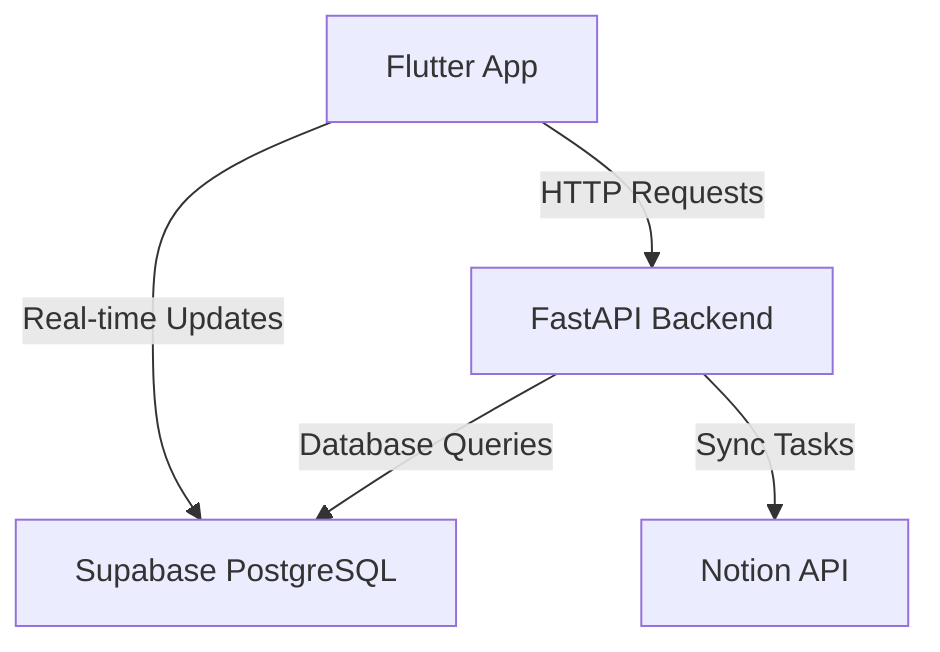

# 🚀 Task Orbit

## Overview
Task Orbit is a comprehensive task management application that seamlessly integrates modern technologies to provide a powerful, cross-platform productivity solution.


## 🛠 Tech Stack

### Backend


### Frontend


### Integration


## 🌟 Key Features

- 🔄 RESTful API endpoints using FastAPI
- 💾 Real-time database operations with Supabase
- 📱 Cross-platform mobile application using Flutter
- 🔗 Notion workspace integration for task management

## 🗺️ Project Architecture



## 🚀 Getting Started

### Prerequisites

- [x] Python 3.10+
- [x] Flutter SDK
- [x] Supabase Account
- [x] Notion API Key

### Installation

1. Clone the repository
```bash
git clone https://github.com/yourusername/task-orbit.git
cd task-orbit
```

2. Set up backend
```bash
cd backend
python -m venv venv
source venv/bin/activate  # On Windows use `venv\Scripts\activate`
pip install -r requirements.txt
```

3. Set up frontend
```bash
cd ../frontend
flutter pub get
```

## 📦 Development Setup

### Environment Variables

Create a `.env` file with the following:
```
SUPABASE_URL=your_supabase_project_url
SUPABASE_KEY=your_supabase_anon_key
NOTION_API_KEY=your_notion_api_key
```

## 🤝 Contributing

We welcome contributions! Please see [CONTRIBUTING.md](CONTRIBUTING.md) for details on our code of conduct and the process for submitting pull requests.

### Contributors

| Avatar | Name | Role | Contributions |
|--------|------|------|--------------|
|  | Saravana Prabhu | Developer | Database Management / API Development |
|  | Rohan Murali | Developer | Frontend Architecture / UI/UX Design |
|  | Sidharth | Developer | Backend / LLM Handler |
|  | Arun Prakash | Developer | Backend Architecture |
|  | Sreekanth | Developer | API Development |
|  | Kishore Kumar | Developer | Backend Development |
|  | Kalanithi | Developer | Backend / Machine Learning |

### Contribution Graph

We appreciate the hard work of our amazing contributors!


### Contribution Statistics

| Contributor | Total Contributions | Pull Requests | Issues |
|------------|---------------------|--------------|--------|
| Saravana Prabhu |  |  |  |
| Rohan Murali |  |  |  |
| Sidharth |  |  |  |
| Arun Prakash |  |  |  |
| Sreekanth |  |  |  |
| Kishore Kumar |  |  |  |
| Kalanithi |  |  |  |

**Note:** Contribution statistics are hypothetical and for demonstration purposes.

## 📊 Project Status


## 📜 License

This project is licensed under the MIT License - see the [LICENSE.md](LICENSE.md) file for details.

## 📞 Contact

- Project Link: [https://github.com/yourusername/task-orbit](https://github.com/yourusername/task-orbit)
- Join our [Discord Community](https://discord.gg/your-discord-link)

---

**Made with ❤️ by the Task Orbit Team**
