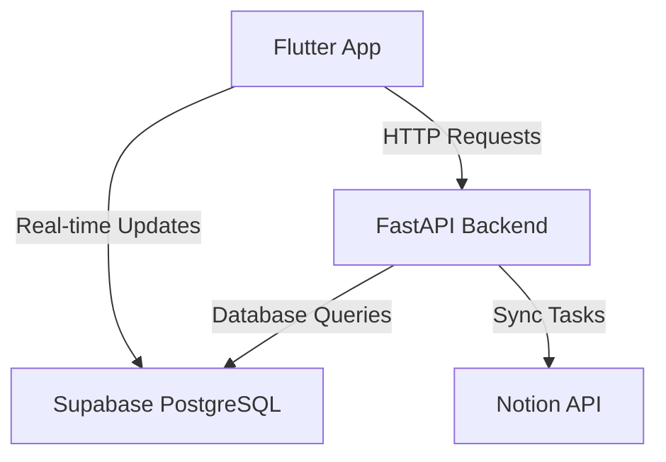

# 🚀 Task Orbit

## Overview
Task Orbit is a comprehensive task management application that seamlessly integrates modern technologies to provide a powerful, cross-platform productivity solution.


## 🛠 Tech Stack

### Backend


### Frontend


### Integration


## 🌟 Key Features

- 🔄 RESTful API endpoints using FastAPI
- 💾 Real-time database operations with Supabase
- 📱 Cross-platform mobile application using Flutter
- 🔗 Notion workspace integration for task management

## 🗺️ Project Architecture



## 🚀 Getting Started

### Prerequisites

- [x] Python 3.10+
- [x] Flutter SDK
- [x] Supabase Account
- [x] Notion API Key

### Installation

1. Clone the repository
```bash
git clone https://github.com/Rohan0109/taskOrbit.git
cd task-orbit
```
2.Build and start the project with Docker

```bash
docker-compose up --build
````
Frontend: Access the Flutter web app at http://localhost:8080.
Backend: Access the FastAPI server at http://localhost:5000.

## 📦 Development Setup

### Environment Variables

Create a `.env` file with the following:
```
SUPABASE_URL=your_supabase_project_url
SUPABASE_KEY=your_supabase_anon_key
NOTION_API_KEY=your_notion_api_key
```

## 🤝 Contributing

We welcome contributions! Please see [CONTRIBUTING.md](CONTRIBUTING.md) for details on our code of conduct and the process for submitting pull requests.

### Contributors

| Avatar | Name | Role | Contributions |
|--------|------|------|--------------|
| 🎨 | Rohan Murali | Developer  | FrontEnd Architecture / UI/UX Design |
| 🧑‍💻 | Saravana Prabhu |  Developer | Database Manage / Api Dev |
| 🔧 |  Sidharth | Developer | Backend / LLM Handler|
| 🔧 |  ArunPrakash | Developer | Developer Activity Tracking  |
| 🔧 |  Kunguma Gokul | Developer | Knowledge Transfer & Documentation  |
| 🧑‍💻 | Sreekanth| Developer  | Api Dev |
| 🧑‍💻 | Kishore Kumar | Developer  | Devops / ML |
| 🧑‍💻 | Kalanithi | Developer  | Backend / ML |
| 🧑‍💻 | Dhinesh | Analyst  |  Business Analytics & Project Metrics |


## 📊 Project Status


## 📜 License

This project is licensed under the MIT License - see the [LICENSE.md](LICENSE.md) file for details.

## 📞 Contact

- Project Link: [https://github.com/yourusername/task-orbit](https://github.com/yourusername/task-orbit)
- Join our [Discord Community](https://discord.gg/vWy7MmNh)

---

**Made with ❤️ by the Task Orbit Team**
